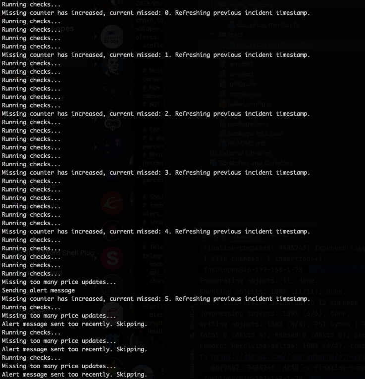
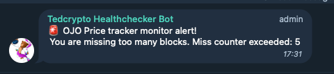

# Ojo price monitor

Monitors the price tracker and if missing too much it will alert
using Telegram

## Run service

This are some optional ways to start the service, feel free to change to best accommodate the way you
run your services.

Before anything, you will need NPM to run this service, if you don't have it installed, you can do it
simply by running:

```bash
sudo apt install npm
```

Then lets clone the repository:

```bash
git clone https://github.com/TedcryptoOrg/ojo-price-tracker-monitor && cd ojo-price-tracker-monitor
```

### Configure your environment (.env)

Copy the file .env.dist to .env and fill the variables with your own values.

```bash
cp .env.dist .env
```

#### Environment variables

| Variable              | Description                                                            |
|-----------------------|------------------------------------------------------------------------|
| SLEEP                 | Run checks in interval of this many seconds                            |
| VALOPER_ADDRESS       | Your validator address                                                 |
| RPC                   | Your RPC address or any public one                                     |
| ALERT_SLEEP_PERIOD    | Don't alert again before this many seconds have pass (default: 5min)   |
| TELEGRAM_BOT_ID       | Telegram bot id                                                        |
| TELEGRAM_TOKEN        | Telegram bot token                                                     |
| TELEGRAM_CHAT         | Telegram chat id                                                       |
| MISS_TOLERANCE        | How much misses allowed                                                |
| MISS_TOLERANCE_PERIOD | How long before reset the miss counter check, in seconds (default: 1h) |

### Install dependencies

We need to install some dependencies like axios and other libraries, you can do it by running:

```bash
npm install
```

### Run with ts-node

ts-node is a binary that allows you to quickly run any typescript script without having to compile it. For convenience
I am doing it this way, but you can also compile the code and run it as a normal node script.

First lets install ts-node if you don't have it already:

```bash
npm install -g ts-node
```

Then you can run the service by running:

```bash
ts-node src/ojo_price_monitor.ts
```

### Configure systemctl service

Now that your service is running fine, we want it to be running in the background, for that you can either use
screen, or you can use a systemctl service.

Again for convenience, I am using systemctl. 

```bash
[Unit]
Description=Ojo price monitor daemon
After=network-online.target

[Service]
User=tedcrypto
ExecStart=/usr/local/bin/ts-node src/ojo_price_monitor.ts
Restart=always
RestartSec=3
LimitNOFILE=4096
WorkingDirectory=/home/tedcrypto/ojo-price-tracker-monitor

[Install]
WantedBy=multi-user.target
```

### Development

If you want to contribute to this project, you can do it by forking the repository and making a pull request.

#### Run tests

```bash
npm run test
```

### Service in screenshots


