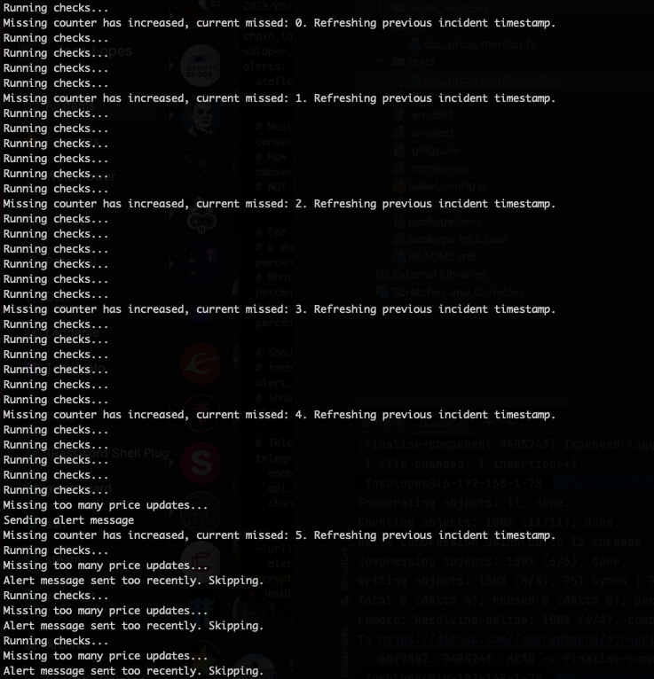
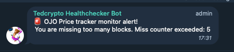

# Ted node monitor

Ted node monitoring is currently just monitoring price oracles. 
You can only use telegram right now.

## Install NVM or NPM

Follow the tutorial for the installation of NVM or NPM.

- [Use NVM](docs/installation/USE_NVM.md)
- [Use NPM](docs/installation/USE_NPM.md)

**Recommended:** Use NVM to manage your node versions, it simplifies greatly the process of installing
and dealing with right versions

## Run the service

To run the service, we need to clone the project, install ts-nodes and dependencies. Below you have the 
steps you need to follow.

### Clone the project

Lets clone the repository:

```bash
git clone https://github.com/TedcryptoOrg/node-monitor && cd node-monitor
```

### Run with ts-node

ts-node is a binary that allows you to quickly run any typescript script without having to compile it. For convenience
I am doing it this way, but you can also compile the code and run it as a normal node script.

First lets install ts-node if you don't have it already:

```bash
npm install -g ts-node
```

Then you can run the service by running:

```bash
ts-node src/index.ts
```

### Configure your environment (.env)

Copy the file .env.dist to .env and fill the variables with your own values.

```bash
cp .env.dist .env
```

#### Environment variables

| Variable              | Description                                                            |
|-----------------------|------------------------------------------------------------------------|
| TELEGRAM_BOT_ID       | Telegram bot id                                                        |
| TELEGRAM_TOKEN        | Telegram bot token                                                     |
| TELEGRAM_CHAT         | Telegram chat id                                                       |

### Create configuration

Run the script `createConfiguration.ts` to create a configuration file

```bash
ts-node scripts/createConfiguration.ts
```

### Install dependencies

We need to install some dependencies like axios and other libraries, you can do it by running:

```bash
npm install
```

## Development

If you want to contribute to this project, you can do it by forking the repository and making a pull request.

### Run tests

```bash
npm test
```

### Run linter

To check for issues:

```bash
npm run lint
```

To try and automate some fixes:

```bash
npm run lint:fix
```

### Service in screenshots (outdated)


